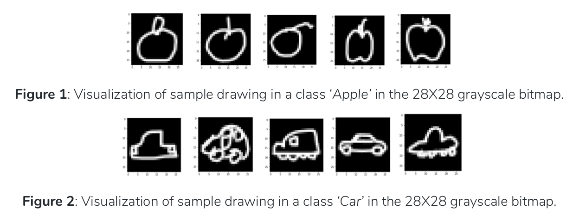

# DoodleGAN
Generating Doodles with a Conditional Generative Adversarial Network

## Getting Started
1. install Tensorflow using Conda
2. Install gsutils
3. install remaining python packages
```
$ pip install -r requirements.txt
```

### Dataset
We use the data from the “​Quick, Draw! Doodle Recognition Challenge.​”
It has 345 categories, including 'Apple', 'Bee', and the Eiffel tower' etc.

Create the dataset in tfrecord format:

```
$ bash download.sh
```

### Training
```
$ python main.py -c configs/baseline.json
```

### Testing
```
$ python main.py -c configs/baseline.json --mode test
```

### Results


